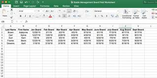

# Working with Spreadsheets

to add: 
- section on cleaning spreadsheets (or shld that go in chpt 6)

Spreadsheets are interactive computer applications for organization, analysis, and storage of data in tabular form. They consist of a table of cells arranged into rows and columns. A cell is simply a  box that holds data. Most spreadsheets use a standard convention where columns are are represented by letters, "A", "B", "C" and rows are normally represented by numbers, 1, 2, 3,.

(image from: https://www.google.com/url?sa=i&source=images&cd=&ved=2ahUKEwjAk6Wd3pnlAhUKKqwKHfnmBAkQjRx6BAgBEAQ&url=https%3A%2F%2Fstablemanagement.com%2Farticles%2Ftips-stable-owners-creating-spreadsheet-54801&psig=AOvVaw1IGNVA8ljGXcio0Vrdvhy8&ust=1571073279950004)

In most math and stats courses, we are taught to refer to the row first and then the column. This comes from linear algebra (the standard mnemonic is to remember the word “RailwayCars”, where the R comes before the C).

The fact is that you are actually looking at a spreadsheet now! The screen you are reading this on is a sort of spreadsheet, with the ‘cells’ filled with different values. The computer then translated this to color and shade. This is how digital photos etc work. Here is a fun video that talks about how pics on a computer are spreadsheets...

https://www.youtube.com/watch?v=UBX2QQHlQ_I 

In general, spreadsheets are fine for storing data, but not so great for analyzing/visualizing data. The reason for this is that the format we use to record data are often made for ease of use of us rather than for ease of use of stats. One of us once got a spreadsheet where different info was connoted by the spaces within each cell. Trying to export that info into a workable format was not easy (see section 6.XXX for how to do this)

The big issue is how can we setup data to be read by both humans **and** computers? 

Most people who have used spreadsheet have used Excel. One of the major drawbacks to Excel is its price (for researchers/students in college they can usually get it for free. But as with other examples once you no longer have access it is hard to get it). HOwever, there are many great things about Excel. I recommend this video which teaches a lot of nice tips and tricks:

https://www.youtube.com/watch?v=0nbkaYsR94c

Excel makes it easy for us to read the data but hard for the computer to read the data. And Excel can also cause some major issues. Follow along the example below (if you have Excel) for an example of what we mean

[insert example here from http://ecologybits.com/index.php/2016/07/06/beware-this-scary-thing-excel-can-do-to-your-data/

## How to best use spreadsheets:

>Assignment: read Karl W. Broman & Kara H. Woo (2018) Data Organization in Spreadsheets,
The American Statistician, 72:1, 2-10, DOI: 10.1080/00031305.2017.1375989

>What examples do they give of bad spreadsheets? What makes a spreadsheet good?

>Assignment: Build a spreadsheet using the tips of Browman & Woo

## Types of data used in spreadsheets:

**Dates**: this is probably one of the largest issues. For example, Excel has 2 different date formats based upon the version of Excel you use. One counts 1900 at the start date and the other counts 1904 (https://support.microsoft.com/en-us/help/214330/differences-between-the-1900-and-the-1904-date-system-in-excel)

As we talked about in the “How computers think” section, \@ref(dates-04) dates work by giving a computer a start time and then calculating how long it has been since that start

Check: [excel-options-advanced] 

## problems

Panko (2008) reported that in 13 audits of real-world spreadsheets, an average of 88% contained errors

examples:https://bmcbioinformatics.biomedcentral.com/articles/10.1186/1471-2105-5-80
https://www.bloomberg.com/news/articles/2013-04-18/faq-reinhart-rogoff-and-the-excel-error-that-changed-history

 
 

## Spreadsheet programs

Excel
GoogleSheets 
Numbers
LibreOce
OnlineCalc
Airtable 
Calligra 

